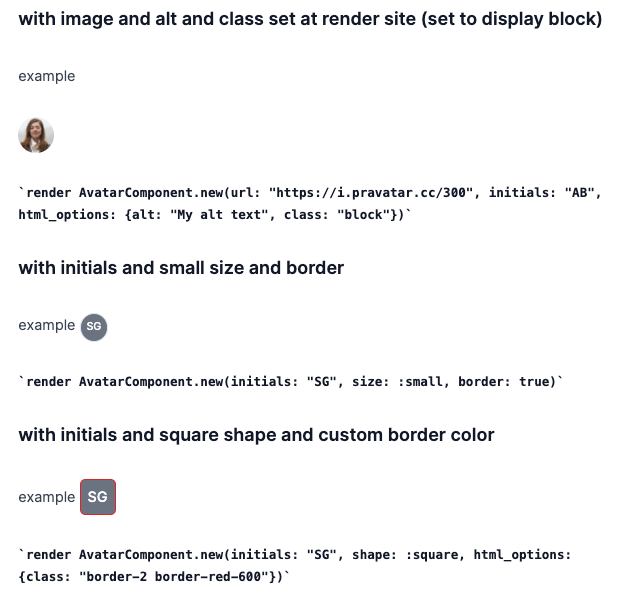

# Vident

Vident helps you create flexible & maintainable component libraries for your application.

Vident makes using Stimulus with your [`ViewComponent`](https://viewcomponent.org/) or [`Phlex`](https://phlex.fun) components easier.

**Note: Vident does not work with ViewComponent 3.0.0.rc2 or later. I'm just starting to restructure the project as various gems at which point I will fix that**. 
Looking to split into gems such as `vident-view_component`, `vident-phlex`,  `vident-typed`, `vident-view_component-caching`, `vident-rspec`, `vident-minitest`, `vident-tailwind` etc

# Motivation

I love working with Stimulus, but I find manually crafting the data attributes for
targets and actions error prone and tedious. Vident aims to make this process easier
and keep me thinking in Ruby. 

I have been using Vident with `ViewComponent` in production apps for a while now and it has been constantly
evolving.

This gem is a work in progress and I would love to get your feedback and contributions!

## What does Vident provide?

- `Vident::Component`: A mixin for your `ViewComponent` components or `Phlex` components that provides the a helper to create the
  root element component (in templated or template-less components).

- `Vident::TypedComponent`: like `Vident::Component` but uses `dry-types` to define typed attributes for your components.

### Various utilities

- `Vident::Tailwind`: a mixin for your vident component which uses [tailwind_merge](https://github.com/gjtorikian/tailwind_merge) to merge TailwindCSS classes
  so you can easily override classes when rendering a component. 

- `Vident::Caching::CacheKey`: a mixin for your vident component which provides a `cache_key` method that can be used to generate a cache key for
  fragment caching or etag generation.

- `Vident::RootComponent::*` which are components for creating the 'root' element in your view components. Similar to `Primer::BaseComponent` but
  exposes a simple API for configuring and adding Stimulus controllers, targets and actions. Normally you create these
  using the `root` helper method on `Vident::Component`/`Vident::TypedComponent`.

# Features

- A helper to create the root HTML element for your component, which then handles creation of attributes.
- Component arguments are defined using the `attribute` method which allows you to define default values, (optionally) types and
  if blank or nil values should be allowed.
- You can use the same component in multiple contexts and configure the root element differently in each context by passing
  options to the component when instantiating it. 
- Stimulus support is built in and sets a default controller name based on the component name.
- Stimulus actions, targets and classes can be setup using a simple DSL to avoid hand crafting the data attributes.
- Since data attribute names are generated from the component class name, you can rename easily refactor and move components without
  having to update the data attributes in your views.
- Components are rendered with useful class names and IDs to make debugging easier (autogenerated IDs are 'random' but deterministic so they
  are the same each time a given view is rendered to avoid content changing/Etag changing).
- (experimental) Support for fragment caching of components (only with ViewComponent and with caveats)
- (experimental) A test helper to make testing components easier by utilising type information from the component arguments to render
  automatically configured good and bad examples of the component.
- (experimental) support for `better_html`


## Things still to do...

This is a work in progress. Here's what's left to do for first release:

- Iterate on the interfaces and functionality
- Add tests
- Make the gem more configurable to fit more use cases
- Create an example library of a few components for some design system
  - Create a demo app with `lookbook` and those components
- Add more documentation
- split `vident` into `vident` + `vident-rails` gems (and maybe `vident-rspec`) (Phlex can be used outside of Rails)
  - possibly also split into `vident-phlex` and `vident-view_component` gems ?


# Examples

Before we dive into a specific example note that there are some components implemented with
both ViewComponent and Phlex (with and without Vident) in the `test/dummy`.
- https://github.com/stevegeek/vident/tree/main/test/dummy/app/components
- https://github.com/stevegeek/vident/tree/main/test/dummy/app/views

Start Rails:

```bash
cd test/dummy
bundle install
rails assets:precompile
rails s
```

and visit http://localhost:3000


## A Vident component example (without Stimulus)

First is an example component that uses `Vident::TypedComponent` but no Stimulus features. 

It is an avatar component that can either be displayed as an image or as initials. 

It supports numerous sizes and shapes and can optionally have a border. It also generates a cache key for use in fragment caching or etag generation.

```ruby
class AvatarComponent < ViewComponent::Base
  include ::Vident::TypedComponent
  include ::Vident::Tailwind
  include ::Vident::Caching::CacheKey

  no_stimulus_controller
  with_cache_key :attributes

  attribute :url, String, allow_nil: true, allow_blank: false
  attribute :initials, String, allow_blank: false

  attribute :shape, Symbol, in: %i[circle square], default: :circle

  attribute :border, :boolean, default: false

  attribute :size, Symbol, in: %i[tiny small normal medium large x_large xx_large], default: :normal

  private

  def html_options
    if image_avatar?
      { class: "inline-block object-contain", src: url, alt: t(".image") }
    else
      { class: "inline-flex items-center justify-center bg-gray-500" }
    end
  end

  def element_classes
    [size_classes, shape_class, border? ? "border" : ""]
  end

  alias_method :image_avatar?, :url?

  def shape_class
    (shape == :circle) ? "rounded-full" : "rounded-md"
  end

  def size_classes
    case size
    when :tiny
      "w-6 h-6"
    when :small
      "w-8 h-8"
    when :medium
      "w-12 h-12"
    when :large
      "w-14 h-14"
    when :x_large
      "sm:w-24 sm:h-24 w-16 h-16"
    when :xx_large
      "sm:w-32 sm:h-32 w-24 h-24"
    else
      "w-10 h-10"
    end
  end

  def text_size_class
    case size
    when :tiny
      "text-xs"
    when :small
      "text-xs"
    when :medium
      "text-lg"
    when :large
      "sm:text-xl text-lg"
    when :extra_large
      "sm:text-2xl text-xl"
    else
      "text-medium"
    end
  end
end
```

```erb
<%= render root(
             element_tag: image_avatar? ? :img : :div,
             html_options: html_options
           ) do %>
  <% unless image_avatar? %>
    <span class="<%= text_size_class %> font-medium leading-none text-white"><%= initials %></span>
  <% end %>
<% end %>

```

Example usages:

```erb
<!-- These will render -->
<%= render AvatarComponent.new(url: "https://someurl.com/avatar.jpg", initials: "AB" size: :large) %>
<%= render AvatarComponent.new(url: "https://someurl.com/avatar.jpg", html_options: {alt: "My alt text", class: "object-scale-down"}) %>
<%= render AvatarComponent.new(initials: "SG", size: :small) %>
<%= render AvatarComponent.new(initials: "SG", size: :large, html_options: {class: "border-2 border-red-600"}) %>

<!-- These will raise an error -->
<!-- missing initals -->
<%= render AvatarComponent.new(url: "https://someurl.com/avatar.jpg", size: :large) %> 
<!-- initials blank -->
<%= render AvatarComponent.new(initials: "", size: :large) %> 
 <!-- invalid size -->
<%= render AvatarComponent.new(initials: "SG", size: :foo_bar) %>
```


The following is rendered when used `render AvatarComponent.new(initials: "SG", size: :small, border: true)`:

```html
<div class="avatar-component w-8 h-8 rounded-full border inline-flex items-center justify-center bg-gray-500" id="avatar-component-9790427-12">
  <span class="text-xs font-medium leading-none text-white">SG</span>
</div>
```

The following is rendered when used `render AvatarComponent.new(url: "https://i.pravatar.cc/300", initials: "AB", html_options: {alt: "My alt text", class: "block"})`:

```html

```

----



## Another ViewComponent + Vident example with Stimulus

Consider the following ERB that might be part of an application's views. The app uses `ViewComponent`, `Stimulus` and `Vident`.

The Greeter is a component that displays a text input and a button. When the button is clicked, the text input's value is
used to greet the user. At the same time the button changes to be a 'reset' button, which resets the greeting when clicked again.


```erb
<%# app/views/home/index.html.erb %>

<!-- ... -->

<!-- render the Greeter ViewComponent (that uses Vident) -->
<%= render ::GreeterComponent.new(cta: "Hey!", html_options: {class: "my-4"}) do |greeter| %>
  <%# this component has a slot called `trigger` that renders a `ButtonComponent` (which also uses Vident) %> 
  <% greeter.trigger(
       
       # The button component has attributes that are typed
       before_clicked: "Greet",
       after_clicked: "Greeted! Reset?",
       
       # A stimulus action is added to the button that triggers the `greet` action on the greeter stimulus controller.
       # This action will be added to any defined on the button component itself
       actions: [
         greeter.action(:click, :greet),
       ],
       
       # We can also override the default button classes of our component, or set other HTML attributes
       html_options: {
         class: "bg-red-500 hover:bg-red-700"
       }
     ) %>
<% end %>

<!-- ... -->
```

The output HTML of the above, using Vident, is:

```html 
<div class="greeter-component py-2 my-4" 
     data-controller="greeter-component" 
     data-greeter-component-pre-click-class="text-md text-gray-500" 
     data-greeter-component-post-click-class="text-xl text-blue-700" 
     id="greeter-component-1599855-6">
  <input type="text" 
         data-greeter-component-target="name" 
         class="shadow appearance-none border rounded py-2 px-3 text-gray-700 leading-tight focus:outline-none focus:shadow-outline">
  <button class="button-component ml-4 whitespace-no-wrap bg-blue-500 hover:bg-blue-700 text-white font-bold py-2 px-4 rounded bg-red-500 hover:bg-red-700" 
          data-controller="button-component" 
          data-action="click->greeter-component#greet button-component#changeMessage" 
          data-button-component-after-clicked-message="Greeted! Reset?" 
          data-button-component-before-clicked-message="Greet" 
          id="button-component-7799479-7">Hey!</button>
  <!-- you can also use the `target_tag` helper to render targets -->
  <span class="ml-4 text-md text-gray-500" 
        data-greeter-component-target="output">
    ...
  </span>
</div>
```

Let's look at the components in more detail.

The main component is the `GreeterComponent`:

```ruby
# app/components/greeter_component.rb

class GreeterComponent < ViewComponent::Base
  include Vident::Component

  renders_one :trigger, ButtonComponent
end
```

```erb
<%# app/components/greeter_component.html.erb %>

<%# Rendering the `root` element creates a tag which has stimulus `data-*`s, a unique id & other attributes set. %>
<%# The stimulus controller name (identifier) is derived from the component name, and then used to generate the relavent data attribute names. %>

<%= render root named_classes: {
  pre_click: "text-md text-gray-500", # named classes are exposed to Stimulus as `data-<controller>-<name>-class` attributes
  post_click: "text-xl text-blue-700",
  html_options: {class: "py-2"}
} do |greeter| %>

  <%# `greeter` is the root element and exposes methods to generate stimulus targets and actions %>
  <input type="text"
         <%= greeter.as_target(:name) %>
         class="shadow appearance-none border rounded py-2 px-3 text-gray-700 leading-tight focus:outline-none focus:shadow-outline">
  
  <%# Render the slot %>
  <%= trigger %>
  
  <%# you can also use the `target_tag` helper to render targets %>
  <%= greeter.target_tag(
        :span, 
        :output, 
        # Stimulus named classes can be referenced to set class attributes at render time
        class: "ml-4 #{greeter.named_classes(:pre_click)}" 
      ) do %>
    ...
  <% end %>
<% end %>

```

```js
// app/components/greeter_component_controller.js

import { Controller } from "@hotwired/stimulus"

// This is a Stimulus controller that is automatically registered for the `GreeterComponent`
// and is 'sidecar' to the component. You can see that while in the ERB we use Ruby naming conventions
// with snake_case Symbols, here they are converted to camelCase names. We can also just use camelCase 
// in the ERB if we want.
export default class extends Controller {
  static targets = [ "name", "output" ]
  static classes = [ "preClick", "postClick" ]

  greet() {
    this.clicked = !this.clicked;
    this.outputTarget.classList.toggle(this.preClickClasses, !this.clicked);
    this.outputTarget.classList.toggle(this.postClickClasses, this.clicked);

    if (this.clicked)
      this.outputTarget.textContent = `Hello, ${this.nameTarget.value}!`
    else
      this.clear();
  }

  clear() {
    this.outputTarget.textContent = '...';
    this.nameTarget.value = '';
  }
}
```

The slot renders a `ButtonComponent` component:

```ruby
# app/components/button_component.rb

class ButtonComponent < ViewComponent::Base
  # This component uses Vident::TypedComponent which uses dry-types to define typed attributes.
  include Vident::TypedComponent

  # The attributes can specify an expected type, a default value and if nil is allowed.
  attribute :after_clicked, String, default: "Greeted!"
  attribute :before_clicked, String, allow_nil: false

  # This example is a templateless ViewComponent.
  def call
    # The button is rendered as a <button> tag with an click action on its own controller.
    render root(
      element_tag: :button,
      
      # We can define actions as arrays of Symbols, or pass manually manually crafted strings.
      # Here we specify the action name only, implying an action on the current components controller
      # and the default event type of `click`.
      actions: [:change_message],
      # Alternatively: [:click, :change_message] or ["click", "changeMessage"] or even "click->button-component#changeMessage"
      
      # A couple of data values are also set which will be available to the controller
      data_maps: [{after_clicked_message: after_clicked, before_clicked_message: before_clicked}],
      
      # The <button> tag has a default styling set directly on it. Note that
      # if not using utility classes, you can style the component using its 
      # canonical class name (which is equal to the component's stimulus identifier), 
      # in this case `button-component`.
      html_options: {class: "ml-4 whitespace-no-wrap bg-blue-500 hover:bg-blue-700 text-white font-bold py-2 px-4 rounded"}
    ) do
      @before_clicked
    end
  end
end
```

```js  
// app/components/button_component_controller.js

import { Controller } from "@hotwired/stimulus"

export default class extends Controller {
  // The action is in camelCase.
  changeMessage() {
    this.clicked = !this.clicked;
    // The data attributes have their naming convention converted to camelCase.
    this.element.textContent = this.clicked ? this.data.get("afterClickedMessage") : this.data.get("beforeClickedMessage");
  }
}

```

## Installation

Add this line to your application's Gemfile:

```ruby
gem 'vident'
```

Also ensure you have installed your chosen view component library, eg:

```ruby
gem 'view_component'
```

or

```ruby
gem 'phlex' # Must be version 0.5 or higher
```

or **both**!

If you want to use typed attributes you must also include `dry-struct`

```ruby
gem 'dry-struct'
```

And then execute:

    $ bundle install

## Making 'sidecar' Stimulus Controllers work

### When using `stimulus-rails`, `sprockets-rails` & `importmap-rails`

Pin any JS modules from under `app/views` and `app/components` which are sidecar with their respective components.

Add to `config/importmap.rb`:

```ruby
components_directories = [Rails.root.join("app/components"), Rails.root.join("app/views")]
components_directories.each do |components_path|
  prefix = components_path.basename.to_s
  components_path.glob("**/*_controller.js").each do |controller|
    name = controller.relative_path_from(components_path).to_s.remove(/\.js$/)
    pin "#{prefix}/#{name}", to: name
  end
end
```

Note we don't use `pin_all_from` as it is meant to work with a subdirectory in `assets.paths`
See this for more: https://stackoverflow.com/a/73228193/268602

Then we need to ensure that sprockets picks up those files in build, so add
to the `app/assets/config/manifest.js`:

```js
//= link_tree ../../components .js
//= link_tree ../../views .js
```

We also need to add to `assets.paths`. Add to your to `config/application.rb`

```ruby
config.importmap.cache_sweepers.append(Rails.root.join("app/components"), Rails.root.join("app/views"))
config.assets.paths.append("app/components", "app/views")
```

### When using `webpacker`

TODO

### When using `propshaft`

TODO

## Using TypeScript for Stimulus Controllers

TODO

## Usage

TODO: Write usage instructions here

## Development

After checking out the repo, run `bin/setup` to install dependencies. Then, run `rake test` to run the tests. You can also run `bin/console` for an interactive prompt that will allow you to experiment.

To install this gem onto your local machine, run `bundle exec rake install`. To release a new version, update the version number in `version.rb`, and then run `bundle exec rake release`, which will create a git tag for the version, push git commits and the created tag, and push the `.gem` file to [rubygems.org](https://rubygems.org).


## Contributing

Bug reports and pull requests are welcome on GitHub at https://github.com/stevegeek/vident. This project is intended to be a safe, welcoming space for collaboration, and contributors are expected to adhere to the [code of conduct](https://github.com/[USERNAME]/vident/blob/master/CODE_OF_CONDUCT.md).

## License

The gem is available as open source under the terms of the [MIT License](https://opensource.org/licenses/MIT).

## Code of Conduct

Everyone interacting in the Vident project's codebases, issue trackers, chat rooms and mailing lists is expected to follow the [code of conduct](https://github.com/[USERNAME]/vident/blob/master/CODE_OF_CONDUCT.md).
